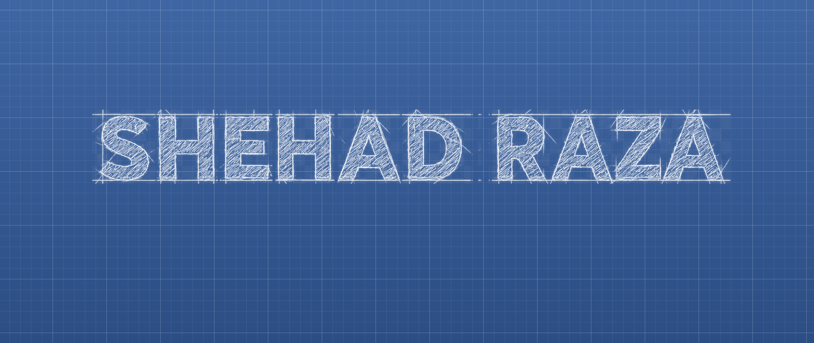

<!-- BANNER -->

  

<!-- TYPING -->

  

 

<!-- ========================= ABOUT ========================= -->

## 🧑‍💻 About Me

- 👋 Hi, I'm **Shehad Raza**
- 🎓 Software Engineering Student
- 💻 Software & Full-Stack Developer
- 🌐 Web Application Developer
- 📱 Mobile Application Developer
- 🤖 AI & AI-powered Application Enthusiast
- ⚙️ Backend & REST API Development
- 🗄️ Database & Cloud Technologies
- 🏢 Building digital solutions with **Nexora Tech**
- 🚀 Passionate about building real-world products
- 🌱 Constantly learning and improving

 

<video width="500" controls autoplay muted loop playsinline>
  <source src="./assets/shehad-intro.mp4" type="video/mp4">
  Your browser does not support the video tag.
</video>

 

---

<!-- ========================= WHAT I BUILD ========================= -->

##  What I Build

<table>
<tr>
<td align="center" width="33%">

### 💻
### Software Development

Practical software solutions for real-world problems.

</td>

<td align="center" width="33%">

### 🌐
### Web Development

Modern, responsive and high-performance web apps.

</td>

<td align="center" width="33%">

### 📱
### Mobile Development

Cross-platform mobile apps with modern UI/UX.

</td>
</tr>

<tr>
<td align="center">

### 🤖
### AI Solutions

AI-powered applications and intelligent features.

</td>

<td align="center">

### ⚙️
### Backend & APIs

REST APIs, authentication, business logic and server-side systems.

</td>

<td align="center">

### 🗄️
### Database

Designing and integrating reliable application databases.

</td>
</tr>
</table>

---

<!-- ========================= CONNECT ========================= -->

##  Connect With Me

---

<!-- ========================= TECHNOLOGY STACK ========================= -->

##  Technology Stack

### 💻 Languages

### 🎨 Frontend

### ⚙️ Backend

### 📱 Mobile

### 🗄️ Database

### ☁️ DevOps & Deployment

### 🧰 Tools

---

<!-- ========================= FEATURED PROJECTS ========================= -->

## 🚀 Featured Projects

### 🏥 Medi

**Smart Healthcare & AI Assistant**

💊 Medicine Reminders  
📊 Health & Medicine Analytics  
🤖 AI Doctor Assistant  
👨‍⚕️ Specialist Recommendation  
🏥 Hospital Discovery  
🌐 Backend API Integration

`Flutter` `Dart` `Node.js` `Express.js` `REST API` `AI`

---

### 👕 A-POSITIVE

**Premium Fashion E-Commerce Platform**

🛍️ Product Management  
🛒 Shopping Cart  
📦 Order Management  
👤 Customer Management  
🔐 Admin Control Center  
💰 Dynamic Pricing  
🎨 Modern UI/UX

`Next.js` `TypeScript` `Tailwind CSS` `Supabase`

---

### 🏋️ Fitlog

**Workout Planning & Management Application**

🏋️ Workout Plans  
✅ Exercise Tracking  
💾 Saved Workouts  
📱 Responsive Interface

`Next.js` `React` `Tailwind CSS`

---

<!-- ========================= GITHUB STATISTICS ========================= -->

##  GitHub Statistics & Analysis

  

---

<!-- ========================= CONTRIBUTION ACTIVITY ========================= -->

## 📈 Contribution Activity

 

<!-- ========================= CONTRIBUTION SNAKE ========================= -->

## 🐍 Contribution Snake

 

<!-- ========================= CONTRIBUTION CALENDAR ========================= -->

## 🗓️ Contribution Calendar

---

<!-- ========================= CONTRIBUTION SNAKE ========================= -->

## 🐍 Contribution Snake

---

<!-- ========================= CURRENTLY LEARNING ========================= -->

## 🧠 Currently Learning

---

<!-- ========================= DEVELOPER PHILOSOPHY ========================= -->

💡 Developer Philosophy

  

“I don't just write code — I build solutions.”

<!-- ========================= RANDOM DEV QUOTE ========================= -->

 Random Dev Quote

<!-- ========================= FOOTER ========================= -->

 

⭐ Thanks for visiting my profile

  

